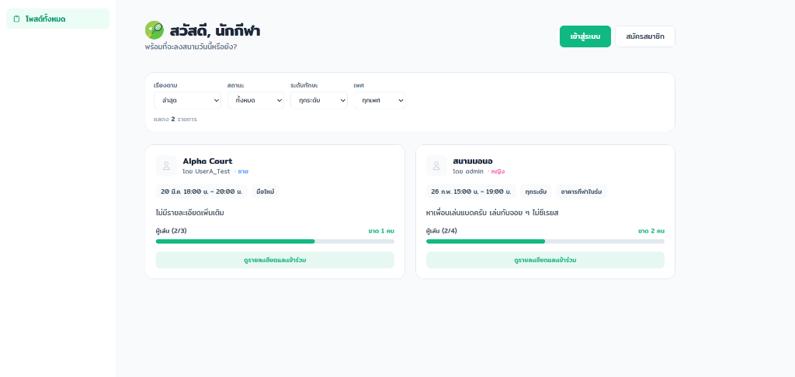
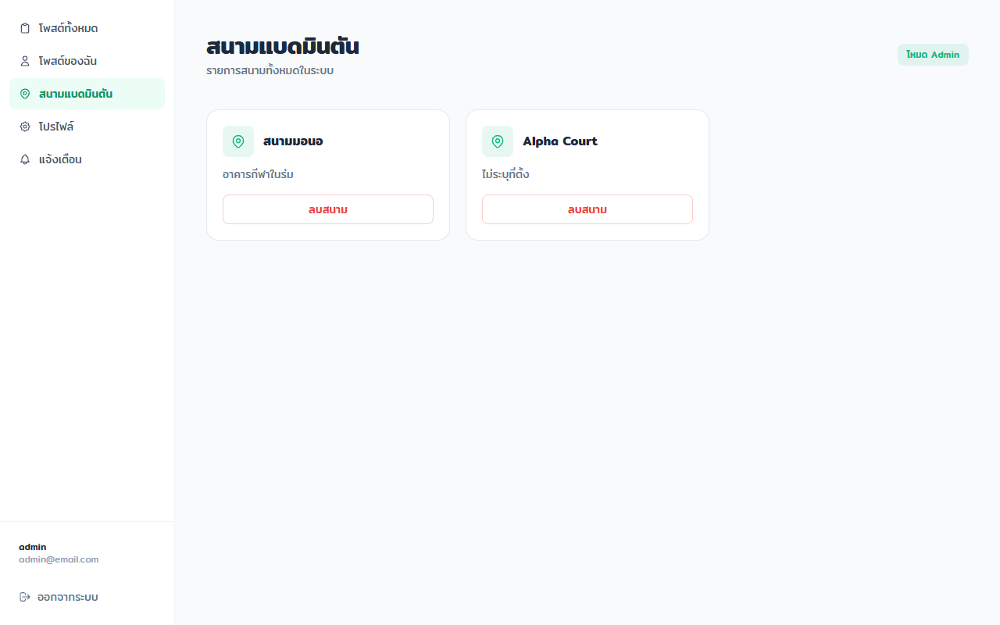
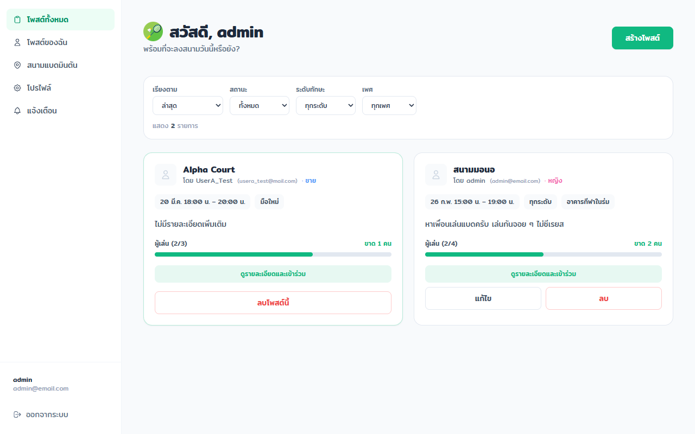
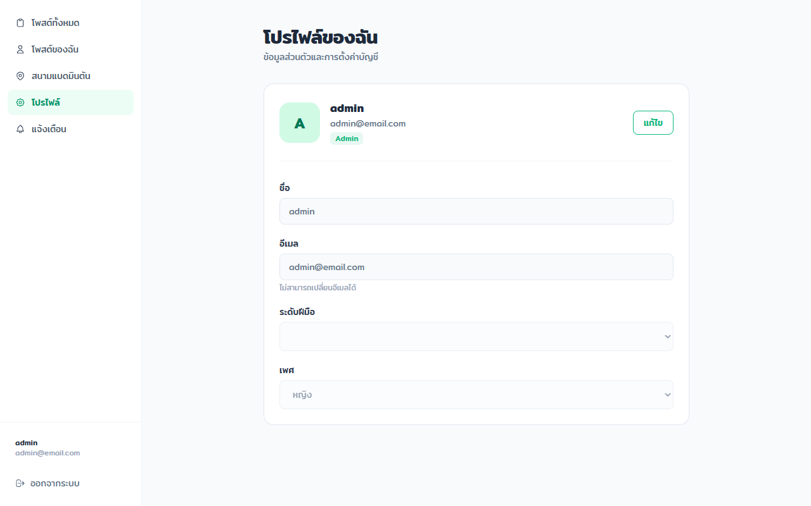
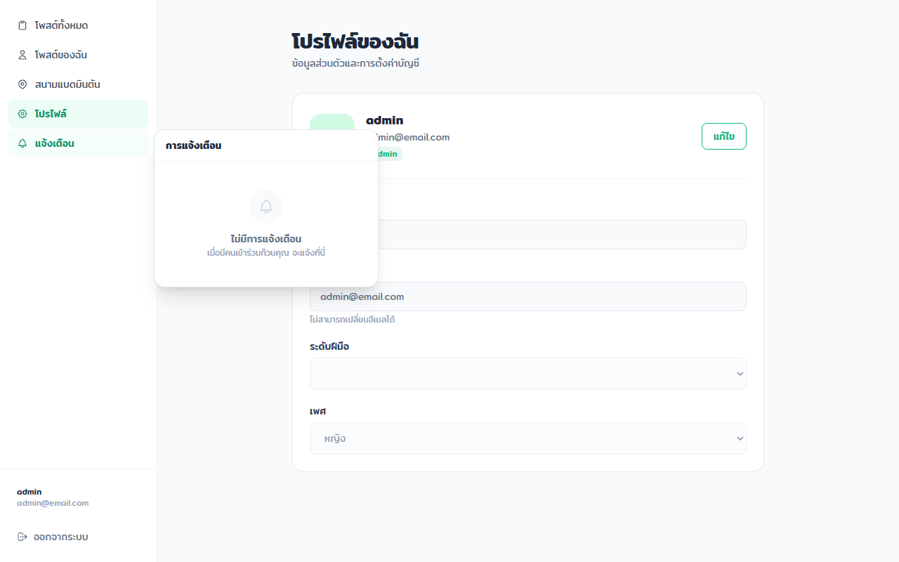

  

# Racket - Badminton Community & Court Booking

Racket เป็นแพลตฟอร์มเว็บแอปพลิเคชันที่พัฒนาขึ้นเพื่อตอบโจทย์ผู้ที่ชื่นชอบในกีฬาแบดมินตัน โดยรวบรวมฟีเจอร์การจองสนามแบดมินตัน, ระบบคอมมูนิตี้สำหรับโพสต์พูดคุยหรือหาเพื่อนเล่น, พร้อมระบบแจ้งเตือนที่ช่วยให้คุณไม่พลาดทุกกิจกรรม

## ฟีเจอร์หลัก (Features)
- ระบบสนาม (Courts): ค้นหาและจัดการการจองสนามแบดมินตันได้อย่างสะดวกสบาย
- คอมมูนิตี้ (Posts): พื้นที่สำหรับผู้ใช้งานในการโพสต์พูดคุย หาเพื่อนตีแบด หรือแลกเปลี่ยนประสบการณ์
- ระบบจัดการผู้ใช้ (Users): รองรับการลงทะเบียน (Register), เข้าสู่ระบบ (Login) และจัดการข้อมูลโปรไฟล์
- การแจ้งเตือน (Notifications): ติดตามสถานะกิจกรรม การจอง และคอมเมนต์ต่างๆ ได้อย่างรวดเร็ว

## ภาพหน้าจอของระบบ (Screenshots)

### หน้าจอจองสนาม (Courts)
ผู้เล่นสามารถค้นหาสนาม ระบุเวลาที่ต้องการ และตรวจสอบจำนวนผู้เล่นที่ยังขาดอยู่ได้

  

### หน้าคอมมูนิตี้ (Posts)
แหล่งรวมโพสต์สำหรับการพูดคุยหรือหาเพื่อนร่วมเล่นแบดมินตัน

  

### หน้าโปรไฟล์ (Profile)
จัดการข้อมูลส่วนตัว ระดับทักษะ (Skill Level) และประวัติการเล่นต่างๆ

  

### การแจ้งเตือน (Notifications)
ระบบอัปเดตแบบเรียลไทม์ ทำให้ผู้ใช้ไม่พลาดทุกความเคลื่อนไหว

  

## เทคโนโลยีที่ใช้ (Tech Stack)

### ฝั่งหน้าบ้าน (Frontend - Client)
- Framework: Vue.js 3
- Build Tool: Vite
- State Management: Pinia (พร้อม plugin persistedstate)
- Styling: Tailwind CSS
- Routing & Networking: Vue Router, Axios

### ฝั่งหลังบ้าน (Backend - Server)
- Environment: Node.js
- Framework: Express.js
- Database ORM: Sequelize (รองรับ MySQL)
- Authentication: Passport.js (JWT Token), bcrypt
- Mailer: Nodemailer
